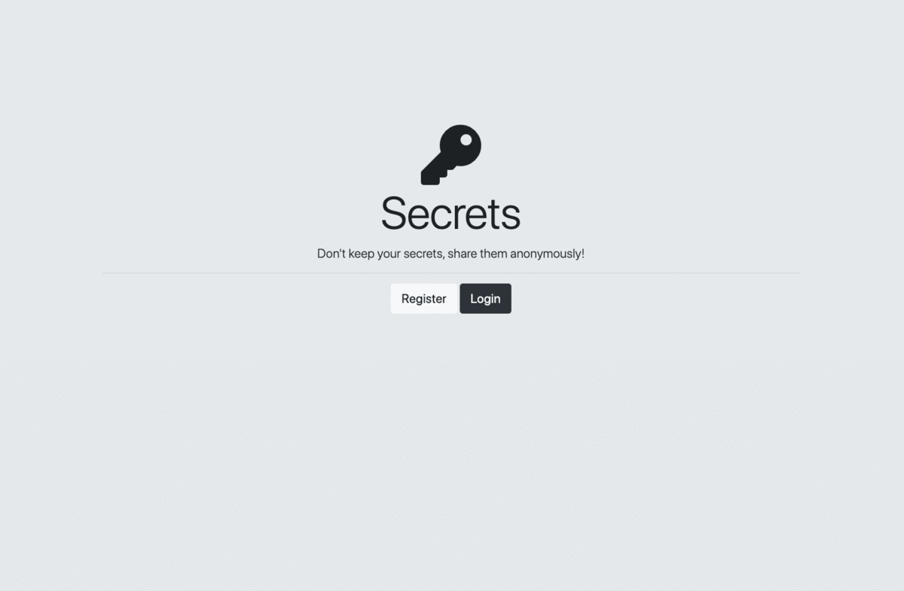

# Share Secrets App

<ul>
  <li>Created a web application that allows users to register and login to share secrets anonymously.</li>
  <li>Stored users account information in MongoDB.</li>
  <li>Encrypted users account information stored in the database using salting rounds and bcrypt hash function to increase the information security by 95%.</li>
  <li>Authenticated user account information, and added cookies and sessions for users using Passport.js.</li>
  <li>Utilized: EJS, Node.js, Express.js, Passport.js, MongoDB</li>
</ul>

<b>Demo:</b>

